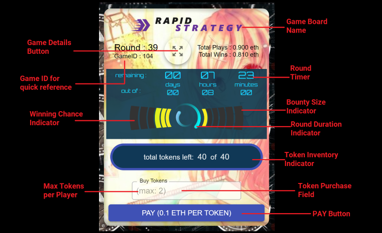
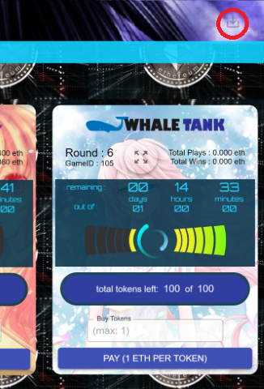
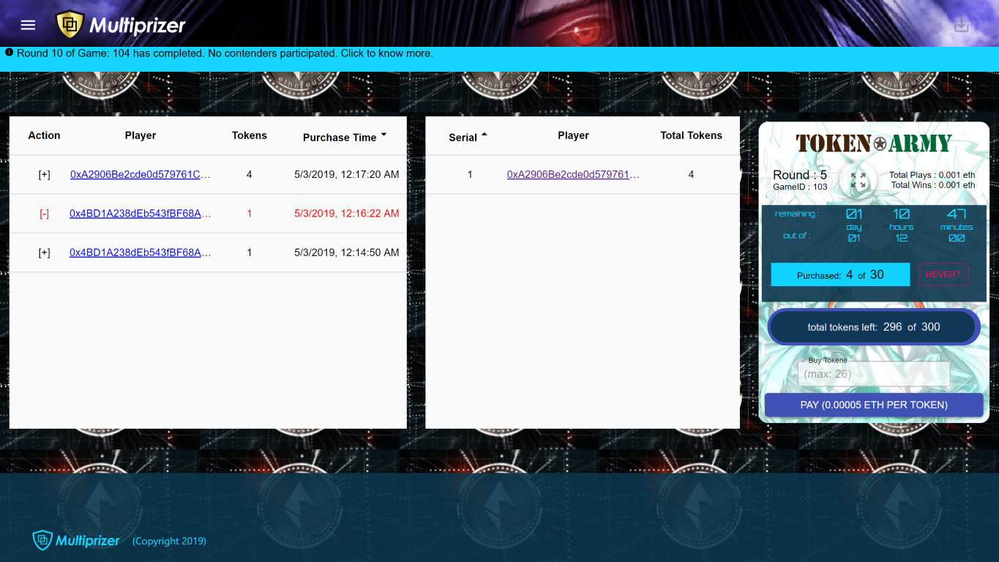
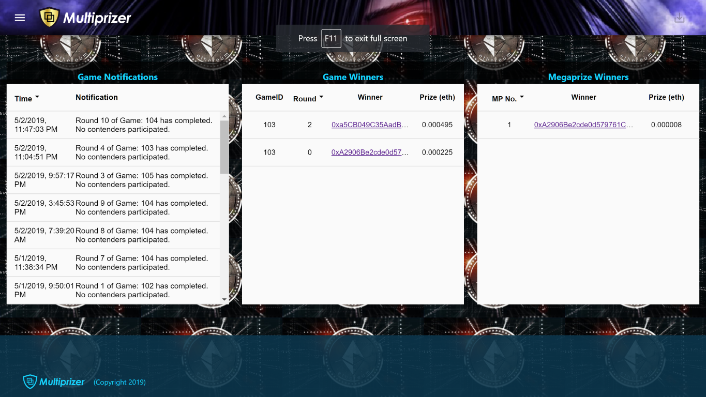

# How To Play

Multiprizer is quite easy to play! 

### 1). First things first, make sure you have Metamask or Trust Wallet with suffecient **_Ethers_**:
This dApp requires **[Metamask](https://metamask.io/)** Extension if you are playing from desktop / laptop, or **[Trust Wallet](https://trustwallet.com/)** if you are playing from a mobile device. Once you have installed it, you need to create a new wallet (or use existing wallet) and get _ethers_ (Ethereum Cryptocurrency). 

### 2). Lets Go to the site and Play!
Visit one of sites below to play Multiprizer. Make sure you set your Metamask / Trust Wallet to whichever network you chose below (Ethereum Mainnet or Ropsten Testnet). **Ethereum Mainnet** contains the production dApp where real ethers are used to play. In case you dont want to spend real ethers right now, you could choose to play in **Ropsten Testnet** after getting some test ethers (which have no intrinsic value). To get free test ethers, visit **[Metamask Faucet](https://faucet.metamask.io/)** or **[Ropsten Faucet](https://faucet.ropsten.be/)**.  

| Network          | DApp URL                        |
|------------------|---------------------------------|
| Ethereum Mainnet | [https://ethereum.multiprizer.io](https://ethereum.multiprizer.io) |
| Ropsten Testnet  | [https://ropsten.multiprizer.io](https://ropsten.multiprizer.io)  |

### 3). Steps to play

* Analyse all the game boards that are present and check the game parameters – Total tokens, max tokens per player, round duration, bounty size, probability of winning etc. Then you choose one or more of the game boards and purchase one or more tokens. The more tokens you purchase, the more your weighted probability to win.

* To purchase the tokens, you need to select the number of tokens to buy from the ‘Buy Tokens’ textbox and press on ‘PAY’ button. This will open your wallet window where you can complete the transaction. You can choose to keep the Gas Price as low as 3Gwei or high as 20GWei for every transaction mentioned in this documentation. Please wait till the transaction is confirmed, which takes only a couple of seconds.

* After confirmation, the game board starts displaying the number of tokens purchased by you. You can subsequently, purchase more tokens or even revert all the tokens purchased yet, by pressing on ‘Revert’ button. On clicking on ‘Revert’, will open your wallet window where you can complete the transaction. Please wait till the transaction is confirmed, which takes only a couple of seconds. 

* Once the timer for the game board completes, a new round begins and automatically, and in a short while, a winner is chosen automatically using the most powerful provable random algorithm in blockchain space. The winner is announced in the light blue notification bar on top, and also in the Notifications page, and the total token amount for that round is automatically transferred to the winner’s address. 

* One can also manually withdraw their winnings by clicking on the ‘Withdraw Winnings’ button at the top right, which gets activated when direct transfer was unsuccessful due to winners keeping a fallback routine at their address. Once completed, please wait till the transaction is confirmed, which only takes a couple of seconds. 

* To get the game details such as logs of token purchases and reverts by players or total tokens bought by various players for that round, one can click on ‘Game Details’ button. 

* Also, on clicking the notification bar above, the notifications pane is accessible which provides complete details of all notifications, winners and mega prize winners.

---
Next:
[MegaPrize](/megaprize)
