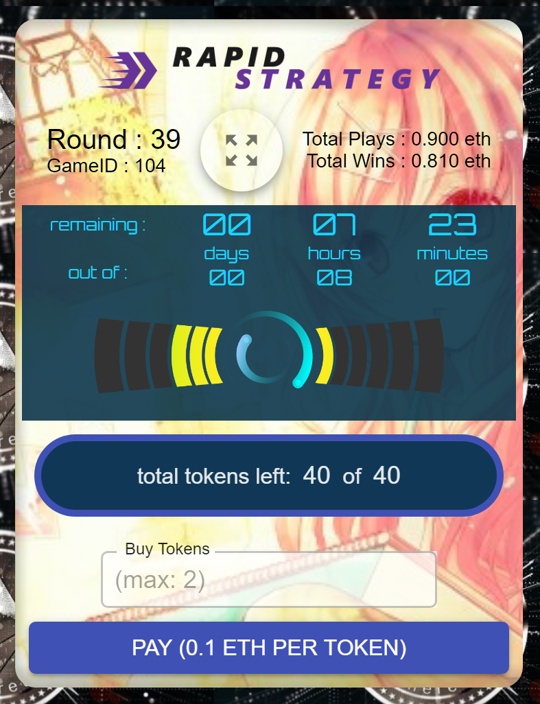

---
# Feel free to add content and custom Front Matter to this file.
# To modify the layout, see https://jekyllrb.com/docs/themes/#overriding-theme-defaults

layout: home
title: Introduction
permalink: /
nav_order: 1
---
# Introduction

Multiprizer is a strategy-based game in which a player can choose from multiple gameboards of different game-play, to play their tokens intelligently. The rounds are time-bound, so after the timer runs out, one person is chosen using the most powerful ‘provable random’ in blockchain history - Ledger based random of Oraclize, with on-chain proof verification. The winner gets all the tokens played during that round, after edge.

What makes Multiprizer unique is it incorporates complete decentralization that blockchain and peer-to-peer networks imbibe, which means the games cannot be influenced by any individual entity and will run perpetually in the Blockchain based world computer.

It also implements the most secure and trust-less platform using best-in-class smart contract design methodology which cannot be tampered with or influenced by malicious players, rogue miners, hardware downtimes or Act of God.

Basically, this game can be played from anywhere around the Earth, with complete privacy and anonymity (pseudonymity) and confidence of security and get back your tokens multiplied on victory!

---
[Play Multiprizer](https://ropsten.multiprizer.io)

